# 🎯 Expert Analyst 项目规范

> 本文档定义了 Expert Analyst 的架构设计和开发规范。

---

## 📌 项目定位

解决**信息不对称**问题的 AI 分析工具：

```
用户问题 → 智能搜索 → 多专家分析 → 迭代验证 → 共识结论 → 多平台导出
```

### 核心价值

| 痛点 | 解决方案 |
|------|----------|
| 信息碎片化 | 自动搜索聚合 |
| 专业门槛高 | 多专家协作分析 |
| 信息可靠性 | 迭代自证机制 |
| 内容分发难 | 一键多平台导出 |

---

## 🏗️ 架构设计

```
┌─────────────────────────────────────────────────────────────┐
│                        用户层                                │
├─────────────┬─────────────────────────────────┬─────────────┤
│  🖥️ Web UI  │         ⌨️ CLI                  │   🔌 API    │
│   (Gradio)  │      (Typer + Rich)             │   (Future)  │
├─────────────┴─────────────────────────────────┴─────────────┤
│                      核心引擎层                              │
├─────────────┬─────────────┬─────────────┬───────────────────┤
│ 🔗 Chain    │ 🧠 Experts  │ 🔄 Iteration│ 📊 Consensus      │
│  分析链编排  │   专家管理   │  迭代验证   │   共识生成        │
├─────────────┴─────────────┴─────────────┴───────────────────┤
│                       插件层                                 │
├─────────────────────┬───────────────────────────────────────┤
│    🔍 Search        │           📤 Export                   │
│   搜索引擎插件       │          导出格式插件                  │
│  - 搜狗搜索         │         - 公众号                       │
│  - 股票数据         │         - 小红书                       │
│                     │         - 新闻稿                       │
├─────────────────────┴───────────────────────────────────────┤
│                      基础设施层                              │
├─────────────────────┬───────────────────────────────────────┤
│    🤖 LLM           │           📁 Storage                  │
│   Ollama 本地模型    │          配置和缓存                    │
└─────────────────────┴───────────────────────────────────────┘
```

---

## 📂 目录结构

```
cool-ai/
├── experts/                 # 🧠 专家定义
│   └── {name}/EXPERT.md    # 每个专家一个目录
│
├── plugins/                 # 🔌 插件系统
│   ├── search/             # 搜索引擎插件
│   ├── data/               # 数据源插件
│   └── export/             # 导出格式插件
│
├── src/                     # 🔧 核心代码
│   ├── core/               # 核心模块
│   │   ├── chain.py        # 分析链编排
│   │   ├── expert.py       # 专家加载器
│   │   ├── llm.py          # LLM 集成
│   │   ├── iteration.py    # 迭代验证
│   │   └── plugin.py       # 插件管理
│   ├── cli/                # 命令行接口
│   └── ui/                 # Web 界面
│
└── templates/               # 📝 导出模板
```

---

## 📋 EXPERT.md 格式规范

每个专家通过 `EXPERT.md` 文件定义：

```markdown
---
name: finance
description: "金融市场分析专家，专注于股票估值、财务分析和市场趋势研判"
metadata: 
  emoji: "📈"
  priority: 1
  domains: ["股票", "基金", "金融", "投资"]
---

# 金融分析专家

你是一位资深金融分析师，具备 CFA 资格认证...

## 分析框架

### 1. 估值分析
- PE/PB/PS 等估值指标
- 横向对比行业水平
- 纵向对比历史区间

### 2. 基本面评估
- 营收增长趋势
- 盈利能力分析
- 现金流状况

### 3. 技术面研判
- K线形态
- 均线系统
- 成交量分析

## 输出要求
- 引用具体数据
- 给出明确建议
- 标注风险提示
```

### 字段说明

| 字段 | 必填 | 说明 |
|------|------|------|
| `name` | ✅ | 专家唯一标识 |
| `description` | ✅ | 专家简介 |
| `metadata.emoji` | ❌ | 显示图标 |
| `metadata.priority` | ❌ | 优先级（越小越优先） |
| `metadata.domains` | ❌ | 擅长领域（用于自动匹配） |

---

## 🔄 分析流程

```mermaid
graph TD
    A[用户提问] --> B[专家匹配]
    B --> C[信息搜索]
    C --> D[获取实时数据]
    D --> E[多专家分析]
    E --> F{需要补充?}
    F -->|是| G[识别信息缺口]
    G --> H[补充搜索]
    H --> E
    F -->|否| I[生成共识]
    I --> J[内容导出]
```



### 详细步骤

1. **问题输入** - 用户提出分析问题
2. **专家匹配** - 根据问题领域自动匹配相关专家
3. **信息搜索** - 通过搜索插件获取实时信息
4. **数据获取** - 获取股票等实时行情数据
5. **多专家分析** - 各专家从不同视角独立分析
6. **迭代自证** - 交叉验证、识别信息缺口、补充搜索
7. **共识生成** - 综合各专家观点形成最终结论
8. **内容导出** - 生成适合不同平台的内容格式

---

## 🔌 插件开发规范

### 搜索插件

```python
from src.core.plugin import SearchPlugin, SearchResult

class MySearchPlugin(SearchPlugin):
    name = "my-search"
    
    async def search(self, query: str, max_results: int = 10) -> list[SearchResult]:
        # 实现搜索逻辑
        return [
            SearchResult(
                title="结果标题",
                url="https://...",
                snippet="摘要内容",
            )
        ]
```

### 导出插件

```python
from src.core.plugin import ExportPlugin

class MyExportPlugin(ExportPlugin):
    name = "my-export"
    
    async def export(self, content: str, metadata: dict) -> str:
        # 实现导出逻辑
        return formatted_content
```

---

## 🛠️ 开发规范

### 代码风格

- Python 3.11+
- 遵循 PEP 8
- 使用 Ruff 进行代码检查
- 类型注解完整

### 异步编程

```python
# ✅ 推荐
async def fetch_data():
    async with httpx.AsyncClient() as client:
        response = await client.get(url)
        return response.json()

# ❌ 避免
def fetch_data():
    response = requests.get(url)  # 阻塞调用
    return response.json()
```

### 错误处理

```python
try:
    result = await some_async_operation()
except SpecificError as e:
    logger.warning(f"操作失败: {e}")
    return fallback_value
```

---

## 📊 性能指标

| 指标 | 目标 |
|------|------|
| 首次响应时间 | < 2s |
| 单专家分析时间 | < 30s |
| 完整分析（4专家x2轮） | < 5min |
| 内存占用 | < 500MB |

---

## 🚧 路线图

- [x] 多专家协作分析
- [x] 实时股票数据
- [x] Web UI 界面
- [x] 多平台导出
- [ ] 分析历史记录
- [ ] 专家知识库
- [ ] API 接口
- [ ] 定时分析任务

---

*Last updated: 2025-01*
